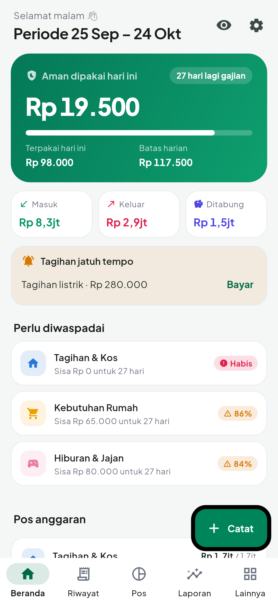
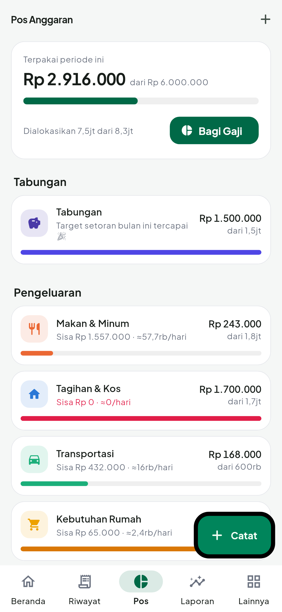
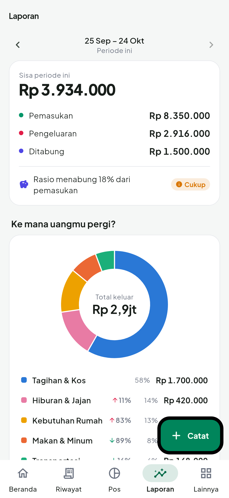
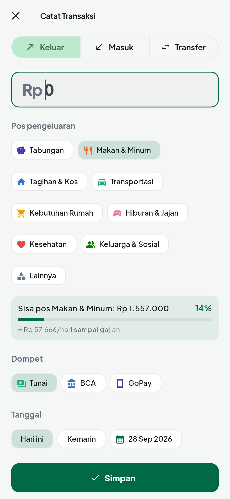

# FinTrack — Tahu ke mana gajimu pergi

FinTrack adalah aplikasi Android (Flutter) untuk mencatat pemasukan & pengeluaran pribadi dengan
pendekatan **pos anggaran per periode gajian**. Tujuannya sederhana: gaji tidak lagi "habis entah ke mana".

| Beranda | Pos anggaran | Laporan | Catat |
|---|---|---|---|
|  |  |  |  |

## Fitur

- **Siklus gajian** — periode dihitung dari tanggal gajian (mis. 25 Sep – 24 Okt), bukan tanggal 1.
- **Pos anggaran & Bagi Gaji** — bagi gaji ke pos (Tabungan, Makan, Tagihan, Transport, …) dengan
  tombol *Saran otomatis*. Tabungan disisihkan di awal dan tidak dihitung sebagai pengeluaran.
- **Batas harian otomatis** — "Aman dipakai hari ini" = (anggaran − yang sudah terpakai) ÷ sisa hari
  sampai gajian. Boros hari ini → jatah besok mengecil; hemat → jatah besok naik. Bisa juga diset manual.
- **Peringatan** — notifikasi & tampilan saat batas harian atau batas pos mencapai 80% dan 100%.
- **Catat cepat** — nominal (titik ribuan otomatis) → pos → simpan. Bisa diedit, geser untuk hapus
  (dengan *Urungkan*).
- **Multi dompet** — Tunai, rekening bank, e-wallet, dengan saldo masing-masing dan transfer antar dompet.
- **Transaksi rutin** — kos, internet, cicilan tercatat otomatis tiap bulan, atau diingatkan untuk
  tagihan yang nominalnya berubah (listrik, air).
- **Target tabungan** — progres, tenggat, dan saran setoran per bulan.
- **Laporan** — donat per pos, grafik pengeluaran harian vs jatah, perbandingan dengan periode lalu,
  rasio menabung, pengeluaran terbesar.
- **Aman** — kunci PIN 6 digit (hash + salt di Android Keystore), sidik jari, kunci otomatis saat
  ditinggal, mode sembunyikan nominal. Semua data hanya di HP (SQLite), tanpa server.
- **Backup / restore** ke file JSON (bisa disimpan ke Google Drive).
- Tema terang & gelap, bahasa Indonesia, font Plus Jakarta Sans.

## Struktur kode

```
lib/
  main.dart, app.dart        # inisialisasi, tema, kunci PIN, onboarding
  core/                      # tema, format rupiah/tanggal, katalog ikon & warna
  data/                      # model, database SQLite, pos bawaan
  logic/                     # periode gajian, anggaran & peringatan, transaksi rutin (murni, teruji)
  state/                     # FinanceStore (state utama), Settings
  services/                  # keamanan (PIN/biometrik), notifikasi
  ui/                        # layar: home, history, budget, reports, more, onboarding, lock, txn
test/                        # unit test logika, test database/store, widget test
docs/screenshots/            # tangkapan layar (dibuat dari test/screenshots_test.dart)
```

## Menjalankan & build

```bash
flutter pub get
flutter test                 # semua pengujian
flutter run                  # jalankan di HP/emulator
flutter build apk --release  # APK di build/app/outputs/flutter-apk/app-release.apk
```

### Kunci rilis (penting)

APK rilis ditandatangani dengan kunci dari `android/key.properties` + file `.jks`. Keduanya **tidak
di-commit** (sudah di `.gitignore`). Simpan baik-baik: update aplikasi harus ditandatangani dengan kunci
yang sama, kalau tidak Android menolak update dan kamu harus uninstall (data hilang kecuali sudah backup).

Isi `android/key.properties`:

```
storePassword=...
keyPassword=...
keyAlias=fintrack
storeFile=fintrack-release.jks
```

Tanpa file ini, build rilis memakai kunci debug.

### Screenshot

```bash
SCREENSHOTS=1 flutter test test/screenshots_test.dart --update-goldens
```
