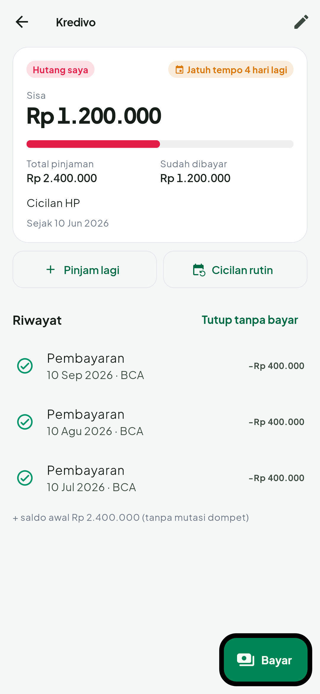

<p align="center"></p>

# KAIT — Kelola Arus Keuangan

**KAIT** = Kelola Arus Keuangan · Kelola Aset & Income · Kelola Duit. *Kait* juga berarti mengait/menarik:
harapan agar rezeki terus datang dan terkumpul.

KAIT adalah aplikasi Android (Flutter) untuk mencatat pemasukan & pengeluaran pribadi dengan pendekatan
**pos anggaran per periode gajian**, supaya gaji tidak lagi "habis entah ke mana".

| Beranda | Catat + scan struk | Hutang | Laporan |
|---|---|---|---|
|  |  |  |  |

## Fitur

- **Siklus gajian** — periode dihitung dari tanggal gajian (mis. 25 Sep – 24 Okt), bukan tanggal 1.
- **Pos anggaran & Bagi Gaji** — bagi gaji ke pos (Tabungan, Makan, Tagihan, Transport, …) dengan
  tombol *Saran otomatis*. Tabungan disisihkan di awal dan tidak dihitung sebagai pengeluaran.
- **Batas harian otomatis** — "Aman dipakai hari ini" = (anggaran pos harian − yang sudah terpakai) ÷ sisa hari
  sampai gajian. Boros hari ini → jatah besok mengecil; hemat → jatah besok naik. Bisa juga diset manual.
  Pos bulanan (kos, tagihan, belanja bulanan, dll.) tidak memotong jatah harian; cukup dipantau batas posnya.
  Setiap pos bisa diatur lewat saklar *Masuk jatah harian*.
- **Peringatan** — notifikasi & tampilan saat batas harian atau batas pos mencapai 80% dan 100%.
- **Catat cepat** — nominal (titik ribuan otomatis) → pos → simpan. Bisa diedit, geser untuk hapus
  (dengan *Urungkan*).
- **Multi dompet** — Tunai, rekening bank, e-wallet, dengan saldo masing-masing dan transfer antar dompet.
- **Transaksi rutin** — kos, internet, cicilan tercatat otomatis tiap bulan, atau diingatkan untuk
  tagihan yang nominalnya berubah (listrik, air).
- **Hutang & piutang** — catat pinjaman (uang masuk dompet atau hutang lama), pelunasan sebagian/penuh,
  sisa & progres, jatuh tempo dengan pengingat H-3 dan hari-H, cicilan bulanan otomatis yang berhenti
  sendiri saat lunas. Pembayaran hutang tidak memakan jatah harian.
- **Scan struk** — foto struk atau pilih dari galeri; total, tanggal, nama toko, dan tebakan pos terisi
  otomatis. OCR memakai Google ML Kit **di dalam HP** (offline), foto langsung dihapus setelah dibaca.
- **Target tabungan** — progres, tenggat, dan saran setoran per bulan.
- **Laporan** — donat per pos, grafik pengeluaran harian vs jatah, perbandingan dengan periode lalu,
  rasio menabung, pengeluaran terbesar.
- **Laporan harian & kalender** — kalender per periode gajian dengan pengeluaran tiap hari dan status
  (aman / hampir / lewat jatah); ketuk tanggal untuk rincian per pos dan daftar transaksinya.
- **Cara hitung batas harian** — ketuk kartu "Aman dipakai hari ini" untuk melihat rincian angkanya.
- **Aman** — kunci PIN 6 digit (hash + salt di Android Keystore), sidik jari, kunci otomatis saat
  ditinggal, mode sembunyikan nominal. Semua data hanya di HP (SQLite), tanpa server.
- **Backup / restore** ke file JSON (bisa disimpan ke Google Drive).
- Tema terang & gelap, bahasa Indonesia, font Plus Jakarta Sans.
- Tanpa izin internet sama sekali.

## Struktur kode

```
lib/
  main.dart, app.dart        # inisialisasi, tema, kunci PIN, onboarding
  core/                      # tema, format rupiah/tanggal, katalog ikon & warna
  data/                      # model, database SQLite, pos bawaan
  logic/                     # periode gajian, anggaran & peringatan, transaksi rutin, parser struk (murni, teruji)
  state/                     # FinanceStore (state utama), Settings
  services/                  # keamanan (PIN/biometrik), notifikasi, pemindai struk (ML Kit)
  ui/                        # layar: home, history, budget, reports, debt, more, onboarding, lock, txn
test/                        # unit test logika, test database/store, widget test
assets/brand/                # logo & ikon KAIT
docs/screenshots/            # tangkapan layar (dibuat dari test/screenshots_test.dart)
```

## Menjalankan & build

```bash
flutter pub get
flutter test                 # semua pengujian
flutter run                  # jalankan di HP/emulator
flutter build apk --release --split-per-abi  # APK per arsitektur di build/app/outputs/flutter-apk/
dart run flutter_launcher_icons              # buat ulang ikon dari assets/brand/
```

### Kunci rilis (penting)

APK rilis ditandatangani dengan kunci dari `android/key.properties` + file `.jks`. Keduanya **tidak
di-commit** (sudah di `.gitignore`). Simpan baik-baik: update aplikasi harus ditandatangani dengan kunci
yang sama, kalau tidak Android menolak update dan kamu harus uninstall (data hilang kecuali sudah backup).

Isi `android/key.properties`:

```
storePassword=...
keyPassword=...
keyAlias=fintrack
storeFile=fintrack-release.jks
```

(Nama kunci & ID paket `com.richi.fintrack` sengaja tidak diganti supaya update bisa dipasang di atas
versi sebelumnya tanpa kehilangan data.)

Tanpa file ini, build rilis memakai kunci debug.

### Screenshot

```bash
SCREENSHOTS=1 flutter test test/screenshots_test.dart --update-goldens
```
